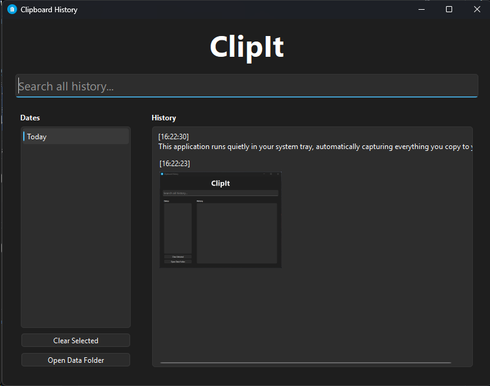

# Clipboard History

A simple yet powerful clipboard history application built with Python and PySide6. It continuously monitors your system clipboard, saving both text and images, and provides a graphical interface to view, manage, and reuse your clipboard history.


## Overview

This application runs quietly in your system tray, automatically capturing everything you copy to your clipboard. Whether it's a snippet of text or an image, the app saves it for later use. With an intuitive interface, you can browse your history, organized by date, and easily copy items back to your clipboard.



## Features

- **Automatic Clipboard Monitoring**: Captures text and image content from the clipboard in the background.
- **Persistent Storage**:
    - Text entries are saved to `history.csv`.
    - Images are stored as PNG files in a dedicated `images` folder.
    - All history is kept in a hidden `.ClipboardHistoryApp` directory in your user profile.
- **Date-Organized History**: Browse your clipboard history chronologically.
- **Reuse Clipboard Items**: Double-click any item to copy it back to your active clipboard.
- **System Tray Integration**: Runs discreetly in the system tray for easy access.
- **Direct Data Folder Access**: A button in the GUI allows you to open the application's data storage folder directly.
- **History Management**: Clear history for a specific date or wipe all recorded history.
- **Custom Application Icon**: Features a custom icon for better visual identification.
- **Search Functionality**: Allows users to search for specific text across their entire clipboard history.

## Requirements

- **Python**: `3.12.4` or newer.
- **Dependencies**:
    - `PySide6`

## Installation

1.  **Clone the repository or download the source code.**
    You'll need `clipboard_gui.py` and `icon.png`.

2.  **Install Dependencies**:
    Open your terminal or command prompt and install the required packages:
    ```bash
    pip install PySide6
    ```

## Usage

### Running the Application

To run the application directly from the script:

```bash
python clipboard_gui.py
```

The application will start and minimize to the system tray. Click the tray icon to open the main window.

### Using the GUI

-   **Main Window**: Shows a list of dates on the left. Select a date to view the clipboard history for that day on the right.
-   **Copy Items**: Double-click any text or image in the history list to copy it back to your clipboard.
-   **Clear History**: Use the "Clear Selected" button to remove the history for the selected date, or right-click a date for more options, including "Clear All Session History".
-   **Open Data Folder**: Click "Open Data Folder" to view the directory where your clipboard history is stored.

## Data Storage Location

All application data is stored in a hidden directory in your user's home folder to avoid cluttering your workspace:

-   **Windows**: `C:\Users\<YourUsername>\.ClipboardHistoryApp\`
-   **macOS/Linux**: `~/.ClipboardHistoryApp/`

## Building an Executable (Optional)

You can create a standalone executable using **PyInstaller**.

1.  **Install PyInstaller**:
    ```bash
    pip install pyinstaller
    ```

2.  **Build the Executable**:
    Run the following command in your terminal from the project directory:
    ```bash
    pyinstaller --onefile --windowed --icon="icon.png" --add-data="icon.png;."
    ```
    - `--onefile`: Creates a single executable.
    - `--windowed`: Prevents a console window from appearing.
    - `--icon="icon.png"`: Sets the application icon.
    - `--add-data="icon.png;."`: Bundles the icon file with the application.

    The executable will be available in the `dist` folder.

## Contributing

Contributions are welcome! If you have suggestions for improvements or new features, feel free to open an issue or submit a pull request.

## License

This project is licensed under the MIT License.